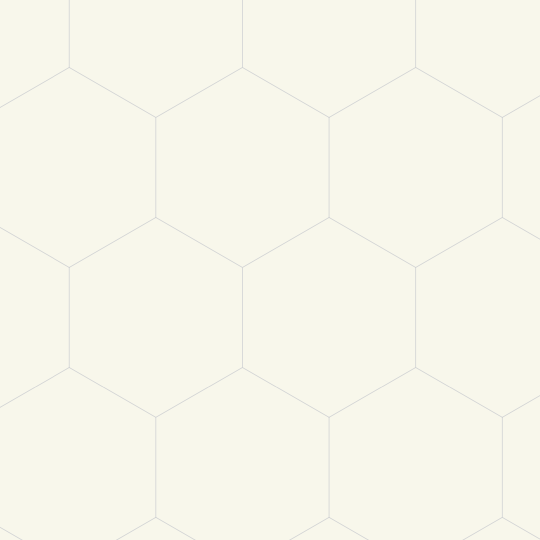
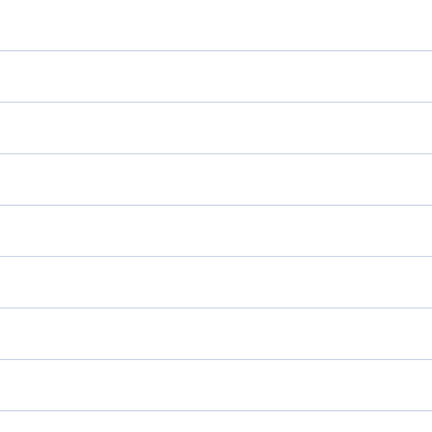
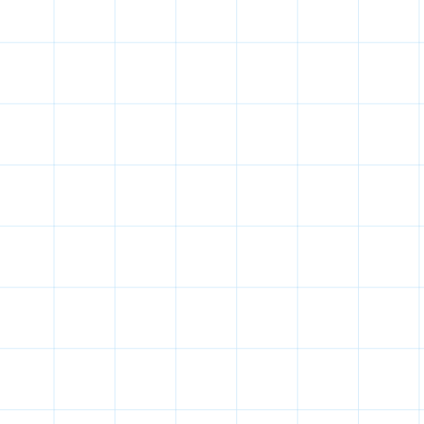

# GoodNotes Template Generator
This template generator will generate PDF templates for GoodNotes.
Its a highly customizable Python script, that uses python scripts as patterns, a json file as the source of the color theme and a json file as a library of paper formats.

## Usage
1. Clone the repository to your local machine:

   ```bash
   git clone https://github.com/rekkep/goodnotes_template_generator.git
   ```

2. Navigate to the project directory:

   ```bash
   cd goodnotes_template_generator
   ```

3. Run the script with the desired paper size:

   ```bash
   python generate_pdfs.py <paper_size> <theme> --patterns <pattern> --orientation <orientation> --density <density> --margin <margin> --thickness <thickness>
   ```

   _Available default paper sizes_: all, a3, a4, a5, a6, a7, standard_landscape, goodnotes_standard, letter, tabloid

   _Available default themes_: dracula, default_white, default_dark, default_yellow, black, midnight, onenote, notability-classic, template
   (**All themes must be in lowercase**)
   
   _Available default patterns_: all, blank, dots, hexagons, lines, squares

   _density_: how dense the pattern should be (**doesn't work with hexagon**)

   _Available orientations_: all, landscape, portrait

    _thickness_: line/dot thickness

   For example:

   ```bash
   python generate_pdfs.py a4 dracula
   ```

4. The generated PDF templates will be stored in the `out\{theme}\{paper_format}` directory.

## TODOs
- [ ] remove unnecessary arguments from pattern functions
- [ ] option for perfect fitted squares (see `patterns\helper\perfect_fill.py`)
- [ ] more patterns
    - [ ] lines with different thickness
    - [ ] squares with sub squares

## Requirements
- `Python >= 3.13.0` (Haven't tried lower versions)
- `reportlab` (`pip install reportlab`)

## Customization
#### **Adding new Themes**:
Open `themes\themes.json` and add a new theme. Themes need to follow the given format:

```json
"template_name": {
        "inspiration": "inspired by", // optional
        "background_color": "HexColorCode",
        "line_color": "HexColorCode"
    }
```

#### **Adding new Paper Sizes**:
Open `\paper_size\paper_sizes.json` and add a new paper size. Paper sizes need to follow the structure:
```py
"paper_name": [width_in_pixel, height_in_pixel]
```

#### **Adding new Patterns**:
Add your pattern as a `.py` file in the patterns dir.
This file should generate the pdf inside the `generate_template` function. As for now, the function can only accepts `output_file, paper_format, density, margin, theme, thickness` as options and all of them must be present.
Therefor the pattern-file should look something like this:

```py
from reportlab.pdfgen import canvas

def generate_template(
    output_file: str,
    paper_format: tuple,
    theme: dict,
    density: int,
    margin: list,
    thickness: float
    ):

    width, height = paper_format
    c = canvas.Canvas(output_file, pagesize=(width, height))

    # Apply background color
    c.setFillColor(theme['background_color'])
    c.rect(0, 0, width, height, fill=True, stroke=False)
    
    c.save()
```

## Examples
#### **Dots with dracula theme and thickness of 1**:


#### **Hexagons with all helplines and in the Midnight theme**:


#### **Hexagons with no helplines and in the GoodNotes yellow theme**:


#### **Lines with Notability-classic theme and [20, 20, 20, 20] as margin**


#### **Squares with OneNote theme**


## Best Options
#### Lines
```bash
--margin "[30,40,20,20]"
--density 35
```

#### Squares
```bash
--margin "[-5, -5, -5, -5]"
--density 54
```

#### Dots
```bash
--margin "[-5, -5, -5, -5]"
--density 54
--thickness 0.5
```

## Credits
#### **HexPaper**
Thanks for [merv1n34k](https://github.com/merv1n34k) for his Hexagon generator Script [HexPaper](https://github.com/merv1n34k/HexaPaper)

#### goodnotes-pdf-template-generator
Thanks for [agedpomelo](https://github.com/agedpomelo) for his work at the [goodnotes-pdf-template-generator](https://github.com/agedpomelo/goodnotes-pdf-template-generator)

#### GoodNotes Colors and Paper size
Thanks for the [reddit user Jalopy-Tech](https://www.reddit.com/user/Jalopy-Tech/) for his [post where he summeriest the goodnotes page sizes and the colors](https://www.reddit.com/r/GoodNotes/comments/1af2auw/standard_page_templates_a4_follows_goodnotes_6/)

## License
Distributed under the MIT License. See LICENSE for more information.

## Contribution
Contributions are welcome! If you find any issues or have suggestions for improvement, please open an issue or submit a pull request.
